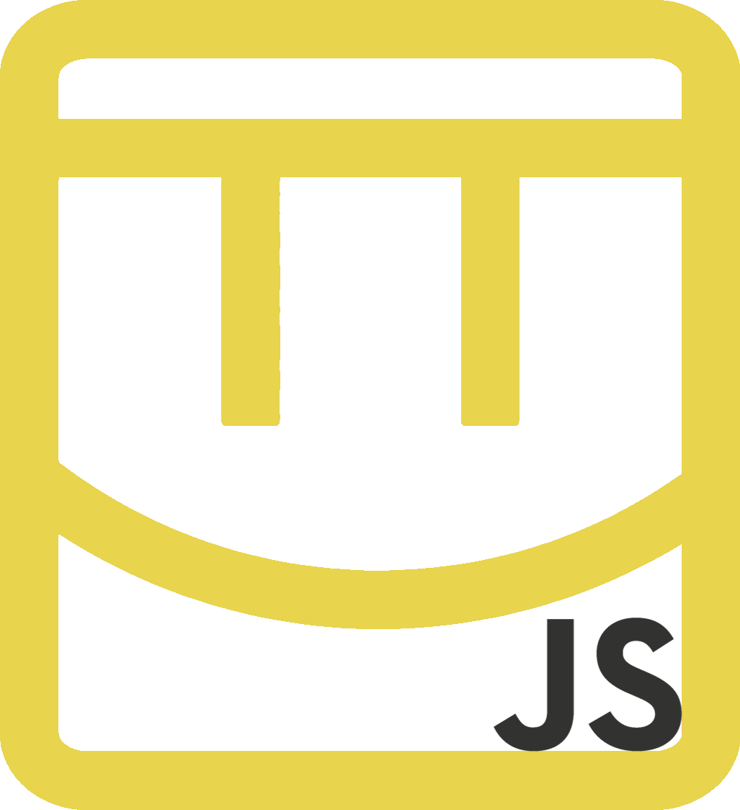

## Notice: at the current moment, RecNet.js is still in it's early stages of life. It is not recommend that you use this as your main server software.

<div align="center">


# RecNet.js
</div>

A RecNet server replacement for old Rec Room builds.

## RecNet.js is..
✅ a localhostable server for single person use

✅ similar to [OpenRec](https://github.com/recroom2016/OpenRec) 

✅ backwards compatible with [OpenRec](https://github.com/recroom2016/OpenRec)

✅ fast, small, and portable (~500kb base download, ~3MB after package download)

## RecNet.js is not...
❌ a server that multiple people can connect to

❌ similar to OpenRec Live / OpenLabs

❌ slow and bloated

**Current supported builds**
- 2016 (Tested with December 23rd 2016)

**Planned builds**
- 2017
- 2018

# Building

This project requires [Node.js](https://nodejs.org/) to be installed before you continue.

```bash
npm i # install requirements
npm run config # edit your configuration - TBA
npm run serve 2016 # play!
```

Config files are created by themselves.

To get this working with builds, you will need to modify them yourself.

# Usage

To start a server, run the following command

```
npm run serve 2016
```

Running `npm run serve` by itself, it will try to autostart whatever version is defined in your config.json file (default: 2016)